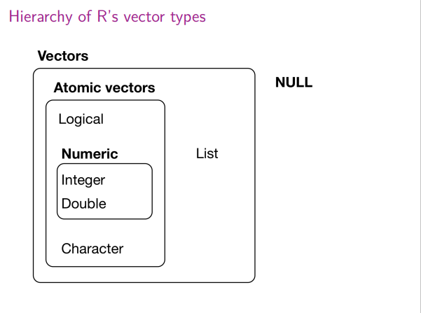
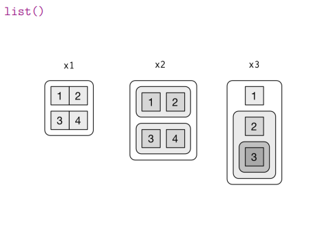
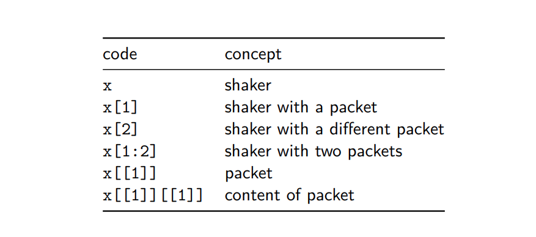
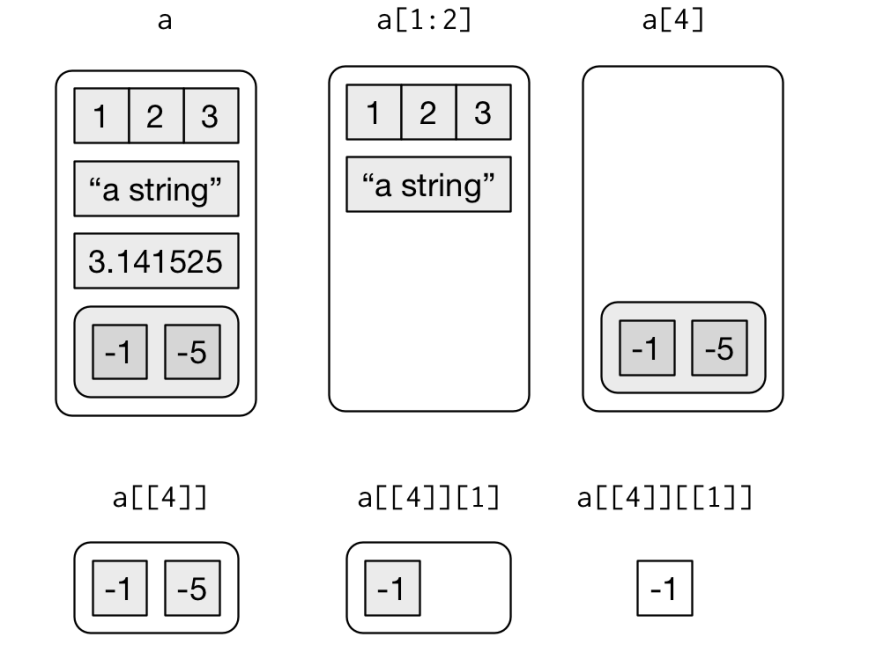

```{r setup, include=FALSE}
knitr::opts_chunk$set(echo = TRUE)
```


# Content 

1. Vector
1. List
1. Data Frame


## Vector


### Type of vector 

```{r echo=FALSE,  fig.cap = "types of vector", out.width = "80%", fig.align = "center"}



```


```{r vector}

letters

# type of vector 
typeof(letters)

typeof(1:10)


# logical

1:7 %% 3 == 0
typeof(1:7 %% 3 == 0)

sum(1:7 %% 3 == 0)
length(1:7 %% 3 == 0)


# length of vector 
length(letters)

length(1:10)


```

### numeric: integer vs double 

```{r numeric }

# create a string of double-precision values
dbl_var <- c(1, 2.5, 4.5)  
dbl_var


# placing an L after the values creates a string of integers
int_var <- c(1L, 6L, 10L)
int_var

typeof(dbl_var)

typeof(int_var)


# converts integers to double-precision values
as.double(int_var)     

# identical to as.double()
x <- as.numeric(int_var)    
x

typeof(x)


# converts doubles to integers
as.integer(dbl_var)         

```

### Implicit coercion: the most complex type wins

```{r}
typeof(c(TRUE,1L))

typeof(c(1L,1.5))

typeof(c(1.5, "a"))

```

### Manipulation of atomic vectors

```{r vetcal}
sample(5) + 100


runif(3) > 0.5

# vector recycling 
1:10 + 1:2

# naming vector
c("x" = 1, "y" = 5, "z" = 10)

```

### Filtering vector 

```{r vetfilt}
# by position 
x <- c("one", "two", "three", "four", "five")

x[1]
x[c(1,4)]
x[-1]
x[c(-1, -3)]

# by logical
x <- c(10, 3, NA, 5, 8, 1, NA)

is.na(x)
!is.na(x)

x[is.na(x)]
x[!is.na(x)]

x[x %% 2 == 0]


# by character
x <- c("abc" = 1, "def" = 2, "xyz" = 5)

x[c("xyz", "def")]

x %in% "1"


```


## List 

```{r list}
x_vec <- c(1,2,3)

x_list <- list(1,2,3)

typeof(x_vec)
typeof(x_list)

x_named <- list(a = 1, b = 2, c = 3)
str(x_list)
str(x_named)
str(x_vec)


```

### how list different from vector 

```{r}

y <- list("a", 1L, 1.5, TRUE)
y 


list_mix <- list("a", "b", 1:10)
list_mix

length(list_mix)
str(list_mix)

# nested list
z <- list(list(1,2), list(3,4))
z

str(z)

# Lists convey hierarchical structure
sentences <- "Housed within the Center for International Development (CID), Evidence for Policy Design (EPoD) is a dynamic research initiative that brings analytical insights, typically from economics, to the design and implementation of public policies and programs around the world. EPoD directly engages with governments and local organizations to identify key questions, design innovative new policies or interventions, and test these using the tools of applied microeconomics, including large field-based experiments. Current research topics at EPoD include governance, social protection, education, entrepreneurship, health, skills, state capacity, sustainable development, and access to finance. "


sentences

library(dplyr)
sentences %>% head(1)

library(stringr)
sentences %>% str_split(" ")

typeof(sentences %>% str_split(" "))


```

### Subsetting list 

```{r echo=FALSE, fig.cap = "Diagram of different list structure", out.width = "80%", fig.align = "center"}



```


```{r echo=FALSE, fig.cap = "code vs concept", out.width = "80%", fig.align = "center"}



```


Code demostration 

```{r listdemo}

a <- list(a = 1:3,
          b = "a string", 
          c = pi,
          d = list(-1, -5))
str(a)

a[1]
a[c(1,3)]

a[[1]]

typeof(a)

typeof(a[1])
typeof(a[[1]])

a[[4]][[2]]

```

```{r echo=FALSE, fig.cap = "Visual demostration", out.width = "80%", fig.align = "center"}



```


## Data Frame 


```{r tibble}

x_tibble <- dplyr::tibble("x" = 1:10, "y" = 21:30)
class(x_tibble)

as.data.frame(x_tibble)

as.matrix(x_tibble)

```


```{r}
# Create the data frame
df <- 	data.frame(
   emp_id = c (6:8), 
   emp_name = c("Rasmi","Pranab","Tusar"),
   salary = c(578.0,722.5,632.8), 
   start_date = as.Date(c("2013-05-21","2013-07-30","2014-06-17")),
   dept = c("IT","Operations","Fianance"),
   stringsAsFactors = FALSE
)

df

class(df)
```


